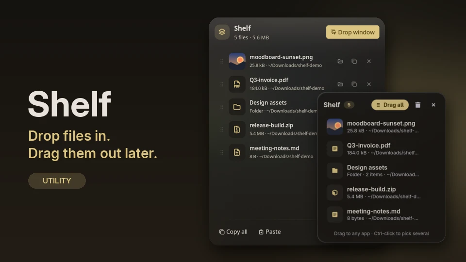

# noctalia-shelf

A drop shelf plugin for [Noctalia](https://github.com/noctalia-dev/noctalia). Drag files onto it from any app, keep
them handy, and drag them out again later.



See [shelf/README.md](shelf/README.md) for requirements, usage, settings, and IPC.

## Install

Add this repository as a plugin source, then enable the plugin:

```sh
noctalia msg plugins source add shelf git https://github.com/alok-debnath/noctalia-shelf
noctalia msg plugins enable alok-debnath/shelf
```

Then add the **Shelf** widget to a bar in **Settings → Bar**.

## Develop

```sh
git clone https://github.com/alok-debnath/noctalia-shelf
ln -s "$PWD/noctalia-shelf/shelf" ~/.local/share/noctalia/plugins/shelf
noctalia msg plugins enable alok-debnath/shelf
```

`.luau` edits hot-reload. The drop window is `shelf/helper/shelf-window.py`; restart it to pick up changes.

## License

MIT
