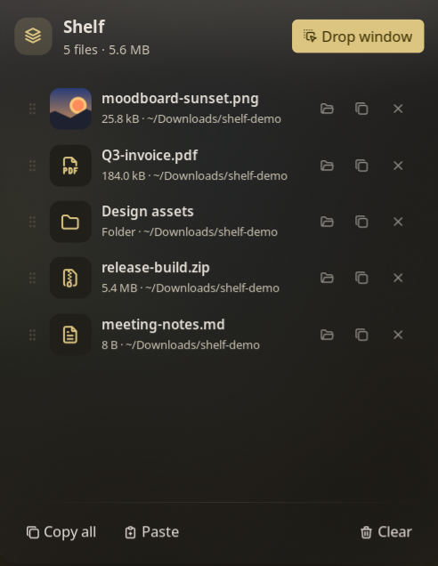
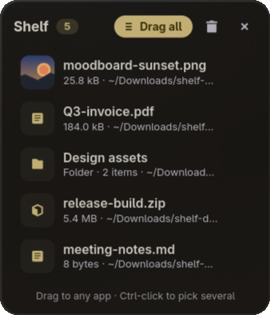

# Shelf

A drop shelf for your desktop. Drag files onto it from any app, keep them there while you work, then drag them out
into a browser upload, a chat, an email, or a folder. Shelf keeps references only: files stay where they are, and
removing something from the shelf never touches the file on disk.




## Plugin

| Field | Value |
| --- | --- |
| ID | `alok-debnath/shelf` |
| Entries | Bar widget: `shelf`; panel: `panel`; service: `service` |

## Requirements

Noctalia plugins cannot take part in Wayland drag and drop yet, so Shelf ships a small GTK 4 window
(`helper/shelf-window.py`) that handles dragging files in and out. It needs:

- `python3`
- `python3-gobject` (PyGObject; `python-gobject` on Arch)
- `gtk4`
- `xdg-utils`, for opening files and folders from the panel

Optional: install `gtk4-layer-shell` and the drop window opens at your mouse cursor (or a screen edge you pick), above your windows. Without it the
window opens as a normal floating window and your compositor decides where it goes.

```sh
# Fedora
sudo dnf install python3-gobject gtk4 gtk4-layer-shell
# Arch
sudo pacman -S python-gobject gtk4 gtk4-layer-shell
```

## Usage

1. Enable the plugin, then add the **Shelf** widget (`alok-debnath/shelf:shelf`) to a bar in
   **Settings → Bar**.
2. Right-click the widget to open the **drop window**. Drag files onto it.
3. Drag files back out of the drop window into any app. Drag a single row, **Ctrl-click** to pick several, or use
   **Drag all**.
4. Left-click the widget to open the **panel**, where you can:
   - click a row to open the file
   - use the row buttons to show the file in its folder, copy it, or remove it from the shelf
   - drag the grip on the left of a row to reorder the shelf
   - **Paste** files you copied in a file manager, or plain file paths, from the clipboard
   - **Copy all** to paste every file into a file manager
   - **Clear** the shelf

Drop window keys: `Esc` closes, `Delete` removes the selected rows, `Ctrl+A` selects all, `Ctrl+V` pastes copied
files, and double-click opens a file.

Toggle the panel:

```sh
noctalia msg panel-toggle alok-debnath/shelf:panel
```

## Settings

Plugin settings live under **Settings → Plugins → Shelf**. Widget settings live with the bar widget.

| Setting | Type | Default | Description |
| --- | --- | --- | --- |
| `window_position` | `select` | `cursor` | Where the drop window opens: centred on the mouse cursor, or docked to a screen edge or corner. Needs `gtk4-layer-shell`. Opening at the cursor uses `hyprctl` and falls back to the screen centre on other compositors. |
| `remove_after_drag` | `bool` | `false` | Take files off the shelf once they are dropped into another app. |
| `close_after_drag` | `bool` | `false` | Close the drop window once files are dropped into another app. |
| `python` | `file` | empty | Interpreter for the drop window. Empty uses `/usr/bin/python3` when it exists, otherwise `python3` from `PATH`. |
| `glyph` (widget) | `glyph` | `stack-2` | Bar icon. |
| `show_count` (widget) | `bool` | `true` | Show the number of files next to the icon. |
| `hide_when_empty` (widget) | `bool` | `false` | Hide the widget while the shelf is empty. |

## IPC

Bind these to keys in your compositor. For example, Hyprland:
`bind = SUPER, S, exec, noctalia msg plugin alok-debnath/shelf:service all toggle`.

```sh
noctalia msg plugin alok-debnath/shelf:service all toggle        # open or close the drop window
noctalia msg plugin alok-debnath/shelf:service all open          # open (or raise) the drop window
noctalia msg plugin alok-debnath/shelf:service all close         # close the drop window
noctalia msg plugin alok-debnath/shelf:service all add /path     # put a file on the shelf
noctalia msg plugin alok-debnath/shelf:service all clear         # empty the shelf
noctalia msg plugin alok-debnath/shelf:service all panel         # toggle the panel
```

## Notes

- **Files written**: the shelf list only, at `<plugin data dir>/shelf.json`, usually
  `~/.local/state/noctalia/plugins/data/alok-debnath/shelf/shelf.json`. Shelf never copies, moves, or deletes your
  files.
- **Processes spawned**: the drop window (`python3 helper/shelf-window.py`), a one-time `python3 -c` check that GTK 4
  is importable, `xdg-open` to open files and folders, `hyprctl` to find the cursor (Hyprland only), and `gdbus` to ask the file manager to highlight a file
  (`org.freedesktop.FileManager1.ShowItems`), falling back to opening the folder.
- **Network**: none.
- The drop window only reads the shelf file. It reports actions (add, remove, clear) as JSON lines on stdout, and the
  plugin service applies them. `gdbus` ships with GLib, which GTK 4 already depends on.
- Thumbnails in the drop window come from the freedesktop thumbnail cache when your file manager made one, or from
  the image itself.
- Tested on Hyprland. The drop window is plain GTK 4, so it works on any Wayland compositor. Edge docking needs a
  compositor with layer-shell support.
